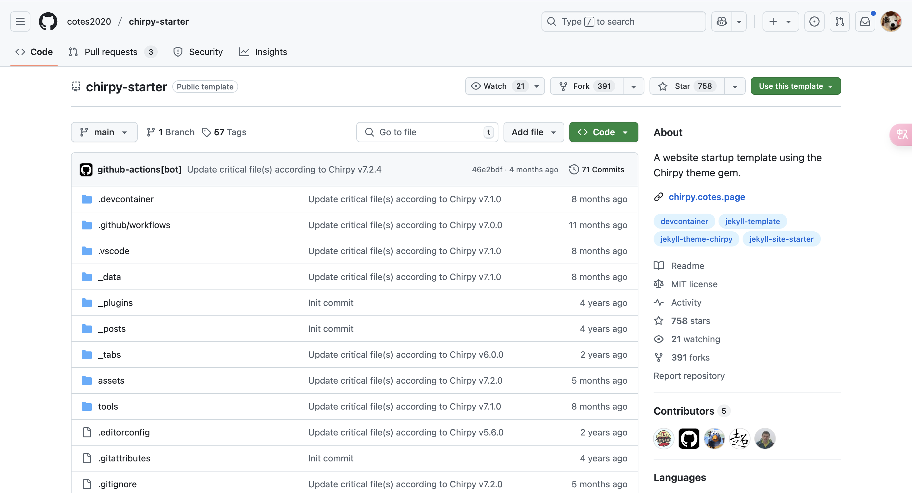
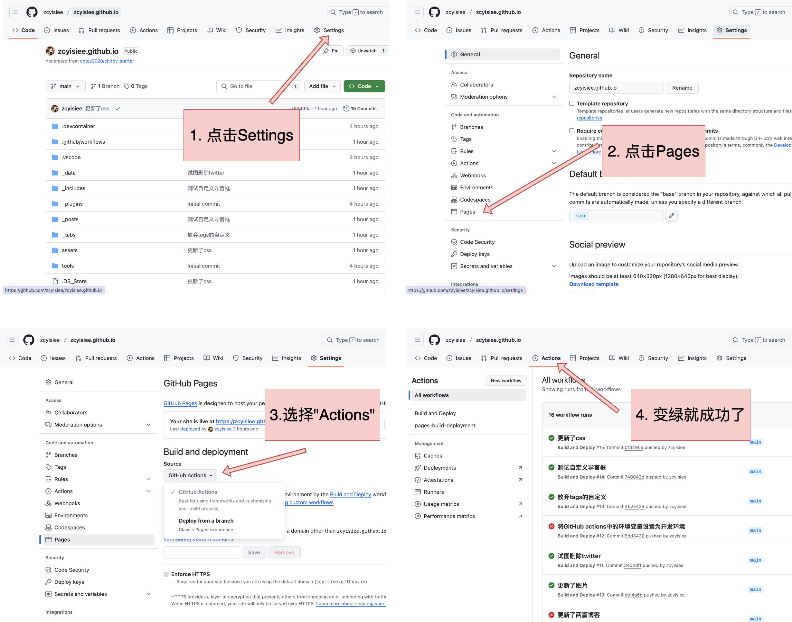

## Quick Start

相较于配置起来异常繁琐的[al-folio](https://github.com/alshedivat/al-folio){:target="_blank"}主题，Chirpy显得非常眉清目秀。官方提供了简洁的[教程](https://chirpy.cotes.page/){:target="_blank"}，此处摘录一下具体的操作。

### Using the Starter

我们从Chirpy提供的模版开始。[stater](https://github.com/cotes2020/chirpy-starter){:target="_blank"}中提供了最简洁的模版，除了必要的文件，其他啥也没有，这是官方推荐的开始方式。官方和我都不建议直接从[源文件](https://github.com/cotes2020/jekyll-theme-chirpy){:target="_blank"}开始构建，因为那不易更新，也不易维护。

{: .w-75}

点击右上角的`Use this template`，将仓库名定义成<你的GitHub名字（小写）>.github.io，就可以开始愉快的配置啦！

### 基本配置

1. 将仓库clone到本地，因为我们要修改一些其中的文件

2. 修改`_config.yml`文件——这是Chirpy中**最重要的文件**，所有与页面相关的信息都在这里呈现。我们现在只修改一个地方即可：将第26行的url换成自己的主页链接`url: "https://zcyisiee.github.io"`，注意末尾不带'/'。然后commit

3. 完成commit后，按照下图进行操作。

   

   第四步可以不操作，但是知道Actions在哪里很重要，后续自定义许多操作时会用到。

### 打开你的链接

不出意外的话，你现在已经可以访问你的链接了`https://<你的github名字>.github.io`，Conguatulation！

## 什么是Chripy

