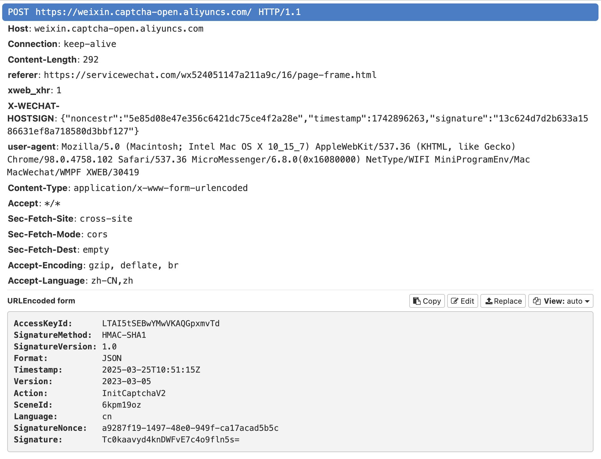
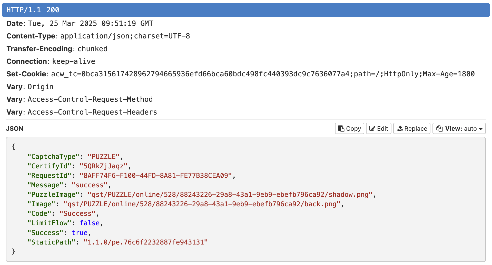
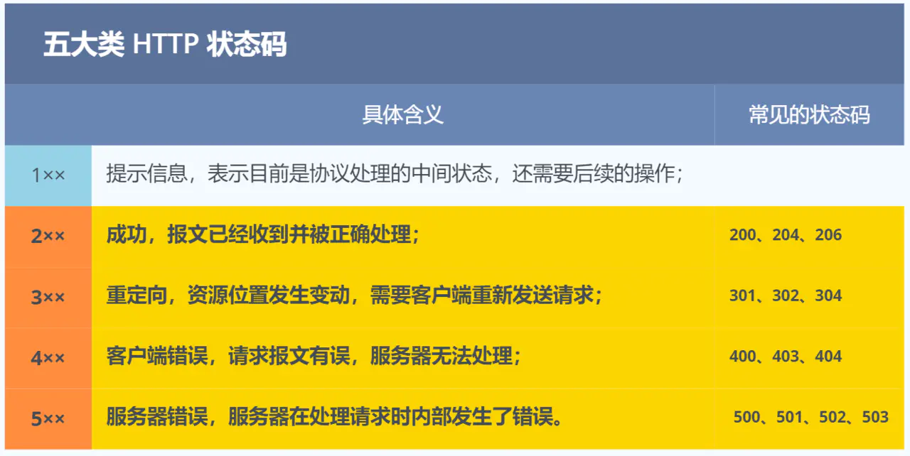
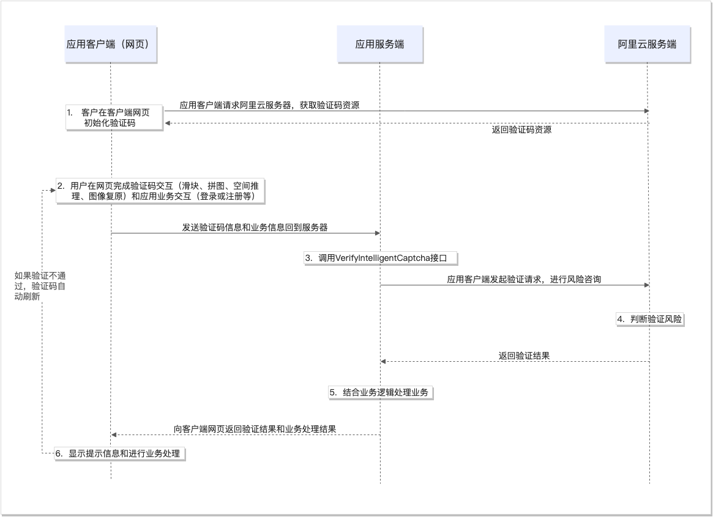
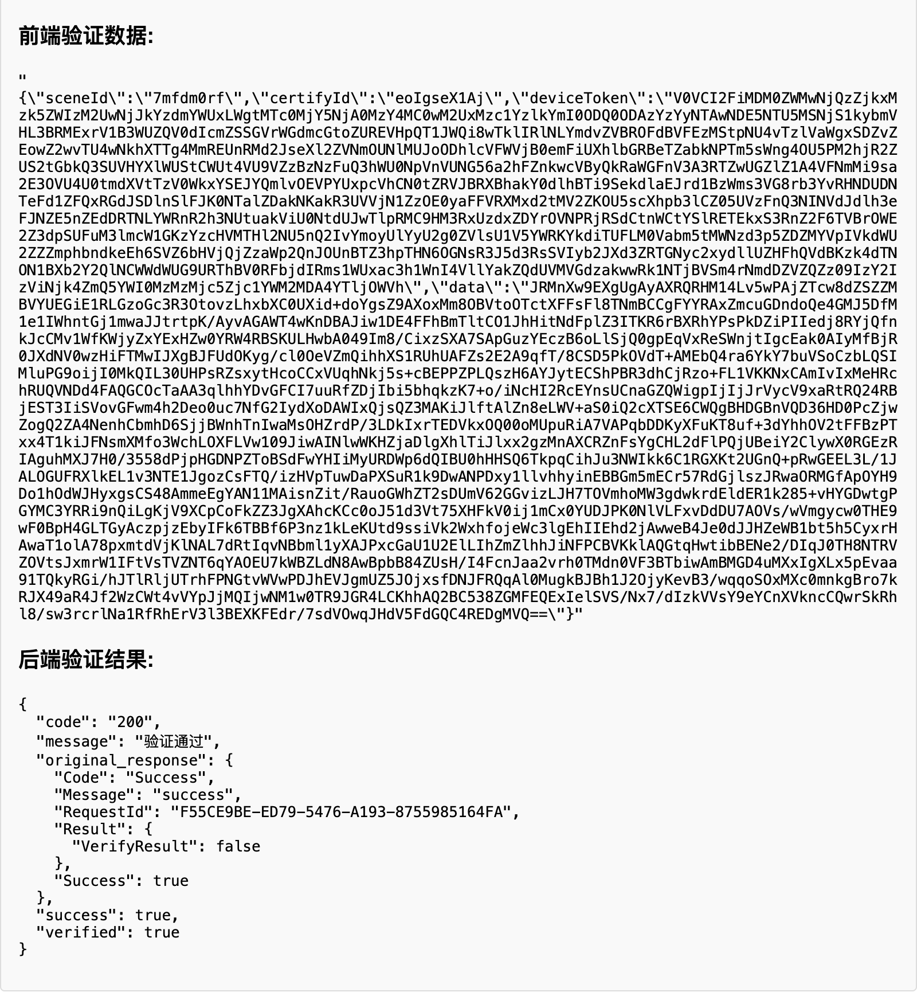

# Basic

## HTTP协议

http协议定义了客户端与服务器之间的通讯方式，由request和response两大部分组成。

### request

request包含三个部分：请求行(request line)，头部(headers)，空行和请求体(body)组成。举个例子：

{: .w-75}

1. 请求行：包括请求方式（POST/GET），请求的URL以及使用的http协议。
2. Headers：由多个键值对组成，每行一个。因此mitmproxy中的Headers对象的格式一定要是键值对。
3. Body：请求体，即本次请求中包含的数据。标准规范中，GET方法是没有请求体的，其请求的参数携带在请求行中，例如，`GET https://zgxx.bnuzh.edu.cn:8887/applet/booking/getSiteListInfo?reservedDate=2025-03-26&siteTypeId=65&venueId=62&chargeType= HTTP/1.1`中，`?`所表示的就是请求参数。

### response

response和request传回的格式是一样的。

{: .w-75}

response的请求行会携带诸如“200，404”之类的状态码，其分类如下：

{: .w-75}

## HTTPS与中间人攻击

### HTTPS协议

HTTPS协议就是HTTP + SSL/TLS。HTTP协议下，数据没有加密，是明文传输，来个人就能看见，属于在互联网上裸奔；SSL会通过CA证书进行对称加密，加完传输的内容就是密文啦！所以HTTPS是比较安全滴！

{: .w-75}

### 中间人攻击

中间人就是骗两头：骗客户端说，我这有CA证书哦，请相信我把！骗服务器说，我要想你发送请求，请给我数据吧！一来一回就能截获客户端发送的内容了

{: .w-75}

## Mitmproxy

### 配置环境

1. 通过`pip install mitmproxy`下载，将mitmproxy添加到环境变量中

#  框架

## 阿里云验证时序图（v2）

{: .w-75}

与v1不同，v2版本中用户完成验证后，阿里云**只返回verifyParam**，其中包含sceneId、certifyId、deviceToken，以及记录了用户滑动轨迹相关数据的data。具体返回的内容如图2。也就是说，滑块相关数据必定经过服务器。如果用户验证失败，也会将信息通过url`https://zgxx.bnuzh.edu.cn:8887/applet/booking/addOrderInfo`POST给服务器

{: .w-75}

​	我们只能拦截verifyParam，但并不知道这个verifyParam是否通过。V2的这种特性导致我们必须提前储存多个请求，防止最后一个请求是“验证未通过”的——就像我第一次失败测试一样😡，也像我测量时间窗口时，发现时间间隔只有20s的时候一样😡。 

######

